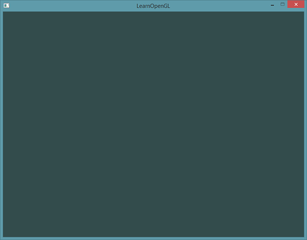

# 你好，窗口

原文     | [Hello Window](http://learnopengl.com/#!Getting-started/Hello-Window)
      ---|---
作者     | JoeyDeVries
翻译     | Geequlim
校对     | Geequlim

让我们试试能不能让GLFW正常工作。首先，新建一个`.cpp`文件，然后把下面的代码粘贴到该文件的最前面。注意，之所以定义`GLEW_STATIC`宏，是因为我们使用的是GLEW静态的链接库。

```c++
// GLEW
#define GLEW_STATIC
#include <GL/glew.h>
// GLFW
#include <GLFW/glfw3.h>
```

!!! Attention

	请确认在包含GLFW的头文件之前包含了GLEW的头文件。在包含glew.h头文件时会引入许多OpenGL必要的头文件（例如`GL/gl.h`），所以你需要在包含其它依赖于OpenGL的头文件之前先包含GLEW。

接下来我们创建<fun>main</fun>函数，在这个函数中我们将会实例化GLFW窗口：

```c++
int main()
{
    glfwInit();
    glfwWindowHint(GLFW_CONTEXT_VERSION_MAJOR, 3);
    glfwWindowHint(GLFW_CONTEXT_VERSION_MINOR, 3);
    glfwWindowHint(GLFW_OPENGL_PROFILE, GLFW_OPENGL_CORE_PROFILE);
    glfwWindowHint(GLFW_RESIZABLE, GL_FALSE);

    return 0;
}
```

首先，我们在main函数中调用<fun>glfwInit</fun>函数来初始化GLFW，然后我们可以使用<fun>glfwWindowHint</fun>函数来配置GLFW。<fun>glfwWindowHint</fun>函数的第一个参数代表选项的名称，我们可以从很多以`GLFW_`开头的枚举值中选择；第二个参数接受一个整形，用来设置这个选项的值。该函数的所有的选项以及对应的值都可以在 [GLFW's window handling](http://www.glfw.org/docs/latest/window.html#window_hints) 这篇文档中找到。如果你现在编译你的cpp文件会得到大量的 *undefined reference* (未定义的引用)错误，也就是说你并未顺利地链接GLFW库。

由于本站的教程都是基于OpenGL 3.3版本展开讨论的，所以我们需要告诉GLFW我们要使用的OpenGL版本是3.3，这样GLFW会在创建OpenGL上下文时做出适当的调整。这也可以确保用户在没有适当的OpenGL版本支持的情况下无法运行。我们将主版本号(Major)和次版本号(Minor)都设为3。我们同样明确告诉GLFW我们使用的是核心模式(Core-profile)，并且不允许用户调整窗口的大小。在明确告诉GLFW使用核心模式的情况下，使用旧版函数将会导致**invalid operation**(无效操作)的错误，而这不正是一个很好的提醒吗？在我们不小心用了旧函数时报错，就能避免使用一些被废弃的用法了。如果使用的是Mac OS X系统，你还需要加下面这行代码到你的初始化代码中这些配置才能起作用：

```c++
glfwWindowHint(GLFW_OPENGL_FORWARD_COMPAT, GL_TRUE);
```

!!! Important

	请确认您的系统支持OpenGL3.3或更高版本，否则此应用有可能会崩溃或者出现不可预知的错误。如果想要查看OpenGL版本的话，在Linux上运行**glxinfo**，或者在Windows上使用其它的工具（例如[OpenGL Extension Viewer](http://download.cnet.com/OpenGL-Extensions-Viewer/3000-18487_4-34442.html)）。如果你的OpenGL版本低于3.3，检查一下显卡是否支持OpenGL 3.3+（不支持的话你的显卡真的太老了），并更新你的驱动程序，有必要的话请更新显卡。

接下来我们创建一个窗口对象，这个窗口对象存放了所有和窗口相关的数据，而且会被GLFW的其他函数频繁地用到。

```c++
GLFWwindow* window = glfwCreateWindow(800, 600, "LearnOpenGL", nullptr, nullptr);
if (window == nullptr)
{
    std::cout << "Failed to create GLFW window" << std::endl;
    glfwTerminate();
    return -1;
}
glfwMakeContextCurrent(window);
```

<fun>glfwCreateWindow</fun>函数需要窗口的宽和高作为它的前两个参数；第三个参数表示这个窗口的名称（标题），这里我们使用`"LearnOpenGL"`，当然你也可以使用你喜欢的名称；最后两个参数我们暂时忽略，先设置为空指针就行。它的返回值<fun>GLFWwindow</fun>对象的指针会在其他的GLFW操作中使用到。创建完窗口我们就可以通知GLFW将我们窗口的上下文设置为当前线程的主上下文了。

## GLEW

在之前的教程中已经提到过，GLEW是用来管理OpenGL的函数指针的，所以在调用任何OpenGL的函数之前我们需要初始化GLEW。

```c++
glewExperimental = GL_TRUE;
if (glewInit() != GLEW_OK)
{
    std::cout << "Failed to initialize GLEW" << std::endl;
    return -1;
}
```

请注意，我们在初始化GLEW之前设置<var>glewExperimental</var>变量的值为`GL_TRUE`，这样做能让GLEW在管理OpenGL的函数指针时更多地使用现代化的技术，如果把它设置为`GL_FALSE`的话可能会在使用OpenGL的核心模式时出现一些问题。

## 视口(Viewport)

在我们开始渲染之前还有一件重要的事情要做，我们必须告诉OpenGL渲染窗口的尺寸大小，这样OpenGL才只能知道怎样相对于窗口大小显示数据和坐标。我们可以通过调用<fun>glViewport</fun>函数来设置窗口的**维度**(Dimension)：

```c++
int width, height;
glfwGetFramebufferSize(window, &width, &height);
  
glViewport(0, 0, width, height);
```

<fun>glViewport</fun>函数前两个参数控制窗口左下角的位置。第三个和第四个参数控制渲染窗口的宽度和高度（像素），这里我们是直接从GLFW中获取的。我们从GLFW中获取视口的维度而不设置为800*600是为了让它在高DPI的屏幕上（比如说Apple的视网膜显示屏）也能[正常工作](http://www.glfw.org/docs/latest/window.html#window_size)。

我们实际上也可以将视口的维度设置为比GLFW的维度小，这样子之后所有的OpenGL渲染将会在一个更小的窗口中显示，这样子的话我们也可以将一些其它元素显示在OpenGL视口之外。

!!! Important

	OpenGL幕后使用<fun>glViewport</fun>中定义的位置和宽高进行2D坐标的转换，将OpenGL中的位置坐标转换为你的屏幕坐标。例如，OpenGL中的坐标(-0.5, 0.5)有可能（最终）被映射为屏幕中的坐标(200,450)。注意，处理过的OpenGL坐标范围只为-1到1，因此我们事实上将(-1到1)范围内的坐标映射到(0, 800)和(0, 600)。

# 准备好你的引擎

我们可不希望只绘制一个图像之后我们的应用程序就立即退出并关闭窗口。我们希望程序在我们明确地关闭它之前不断绘制图像并能够接受用户输入。因此，我们需要在程序中添加一个while循环，我们可以把它称之为<def>游戏循环</def>(Game Loop)，它能在我们让GLFW退出前一直保持运行。下面几行的代码就实现了一个简单的游戏循环：

```c++
while(!glfwWindowShouldClose(window))
{
    glfwPollEvents();
    glfwSwapBuffers(window);
}
```

- <fun>glfwWindowShouldClose</fun>函数在我们每次循环的开始前检查一次GLFW是否被要求退出，如果是的话该函数返回`true`然后游戏循环便结束了，之后为我们就可以关闭应用程序了。
- <fun>glfwPollEvents</fun>函数检查有没有触发什么事件（比如键盘输入、鼠标移动等），然后调用对应的回调函数（可以通过回调方法手动设置）。我们一般在游戏循环的开始调用事件处理函数。
- <fun>glfwSwapBuffers</fun>函数会交换颜色缓冲（它是一个储存着GLFW窗口每一个像素颜色的大缓冲），它在这一迭代中被用来绘制，并且将会作为输出显示在屏幕上。

!!! Important

	**双缓冲(Double Buffer)**

	应用程序使用单缓冲绘图时可能会存在图像闪烁的问题。 这是因为生成的图像不是一下子被绘制出来的，而是按照从左到右，由上而下逐像素地绘制而成的。最终图像不是在瞬间显示给用户，而是通过一步一步生成的，这会导致渲染的结果很不真实。为了规避这些问题，我们应用双缓冲渲染窗口应用程序。**前**缓冲保存着最终输出的图像，它会在屏幕上显示；而所有的的渲染指令都会在**后**缓冲上绘制。当所有的渲染指令执行完毕后，我们**交换**(Swap)前缓冲和后缓冲，这样图像就立即呈显出来，之前提到的不真实感就消除了。

## 最后一件事

当游戏循环结束后我们需要正确释放/删除之前的分配的所有资源。我们可以在<fun>main</fun>函数的最后调用<fun>glfwTerminate</fun>函数来释放GLFW分配的内存。

```c++
glfwTerminate();
return 0;
```

这样便能清理所有的资源并正确地退出应用程序。现在你可以尝试编译并运行你的应用程序了，如果没做错的话，你将会看到如下的输出：


如果你看见了一个非常无聊的黑色窗口，那么就对了！如果你没得到正确的结果，或者你不知道怎么把所有东西放到一起，请到[这里](http://learnopengl.com/code_viewer.php?code=getting-started/hellowindow)参考源代码。

如果程序编译有问题，请先检查连接器选项是否正确，IDE中是否导入了正确的目录（前面教程解释过）。并且请确认你的代码是否正确，直接对照上面提供的源代码就行了。如果还是有问题，欢迎评论，我或者其他人可能会帮助你的。

## 输入

我们同样也希望能够在GLFW中实现一些键盘控制，这可以通过使用GLFW的回调函数(Callback Function)来完成。<def>回调函数</def>事实上是一个函数指针，当我们设置好后，GLWF会在合适的时候调用它。**按键回调**(KeyCallback)是众多回调函数中的一种。当我们设置了按键回调之后，GLFW会在用户有键盘交互时调用它。该回调函数的原型如下所示：

```c++
void key_callback(GLFWwindow* window, int key, int scancode, int action, int mode);
```

按键回调函数接受一个<fun>GLFWwindow</fun>指针作为它的第一个参数；第二个整形参数用来表示按下的按键；`action`参数表示这个按键是被按下还是释放；最后一个整形参数表示是否有Ctrl、Shift、Alt、Super等按钮的操作。GLFW会在合适的时候调用它，并为各个参数传入适当的值。


```c++
void key_callback(GLFWwindow* window, int key, int scancode, int action, int mode)
{
    // 当用户按下ESC键,我们设置window窗口的WindowShouldClose属性为true
    // 关闭应用程序
    if(key == GLFW_KEY_ESCAPE && action == GLFW_PRESS)
    	glfwSetWindowShouldClose(window, GL_TRUE);
}    
```

在我们（新创建的）<fun>key_callback</fun>函数中，我们检测了键盘是否按下了Escape键。如果键的确按下了(不释放)，我们使用<fun>glfwSetwindowShouldClose</fun>函数设定`WindowShouldClose`属性为`true`从而关闭GLFW。main函数的`while`循环下一次的检测将为失败，程序就关闭了。

最后一件事就是通过GLFW注册我们的函数至合适的回调，代码是这样的:

```c++
glfwSetKeyCallback(window, key_callback);  
```

除了按键回调函数之外，我们还能我们自己的函数注册其它的回调。例如，我们可以注册一个回调函数来处理窗口尺寸变化、处理一些错误信息等。我们可以在创建窗口之后，开始游戏循环之前注册各种回调函数。


## 渲染

我们要把所有的渲染(Rendering)操作放到游戏循环中，因为我们想让这些渲染指令在每次游戏循环迭代的时候都能被执行。代码将会是这样的：

```c++
// 程序循环
while(!glfwWindowShouldClose(window))
{
    // 检查事件
    glfwPollEvents();

    // 渲染指令
    ...

    // 交换缓冲
    glfwSwapBuffers(window);
}
```

为了测试一切都正常工作，我们使用一个自定义的颜色清空屏幕。在每个新的渲染迭代开始的时候我们总是希望清屏，否则我们仍能看见上一次迭代的渲染结果（这可能是你想要的效果，但通常这不是）。我们可以通过调用<fun>glClear</fun>函数来清空屏幕的颜色缓冲，它接受一个缓冲位(Buffer Bit)来指定要清空的缓冲，可能的缓冲位有<var>GL_COLOR_BUFFER_BIT</var>，<var>GL_DEPTH_BUFFER_BIT</var>和<var>GL_STENCIL_BUFFER_BIT</var>。由于现在我们只关心颜色值，所以我们只清空颜色缓冲。

```c++
glClearColor(0.2f, 0.3f, 0.3f, 1.0f);
glClear(GL_COLOR_BUFFER_BIT);
```

注意，除了<fun>glClear</fun>之外，我们还调用了<fun>glClearColor</fun>来设置清空屏幕所用的颜色。当调用<fun>glClear</fun>函数，清除颜色缓冲之后，整个颜色缓冲都会被填充为<fun>glClearColor</fun>里所设置的颜色。在这里，我们将屏幕设置为了类似黑板的深蓝绿色。

!!! Important

	你应该能够回忆起来我们在 *OpenGL* 这节教程的内容，<fun>glClearColor</fun>函数是一个状态设置函数，而<fun>glClear</fun>函数则是一个状态应用的函数。



这个程序的完整源代码可以在[这里](http://learnopengl.com/code_viewer.php?code=getting-started/hellowindow2)找到。

好了，现在我们已经做好开始在游戏循环中添加许多渲染调用的准备了，但这是[下一节](04 Hello Triangle.md)教程了，这一节的内容已经太多了。